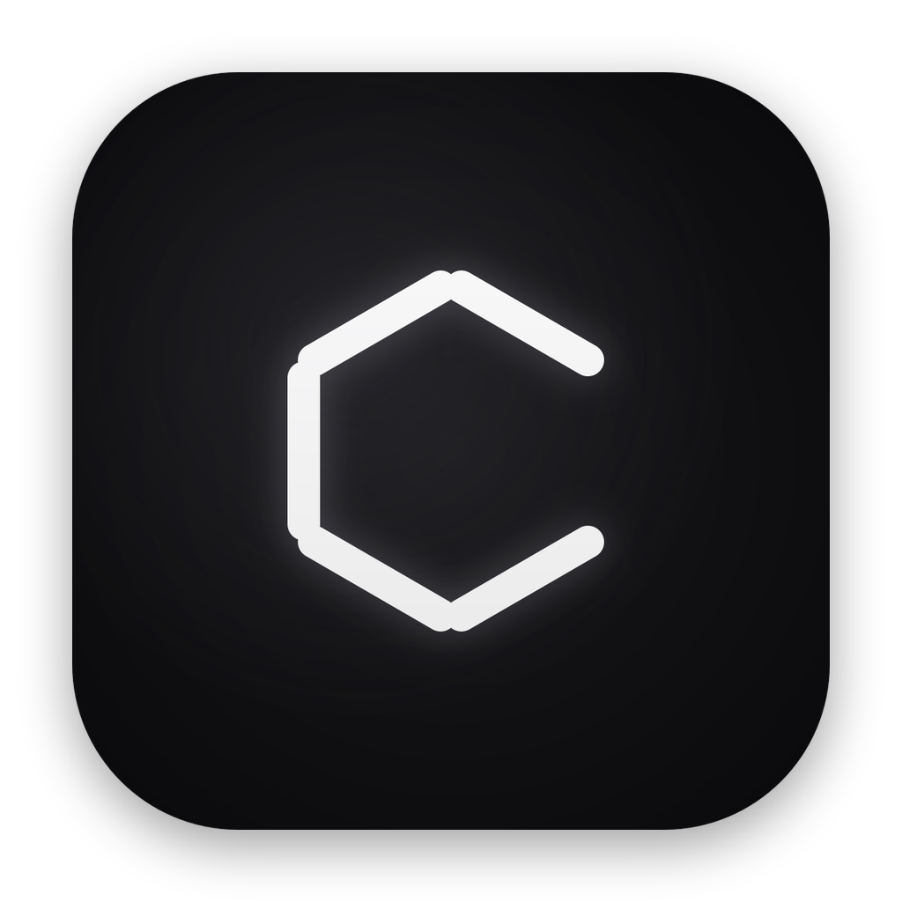
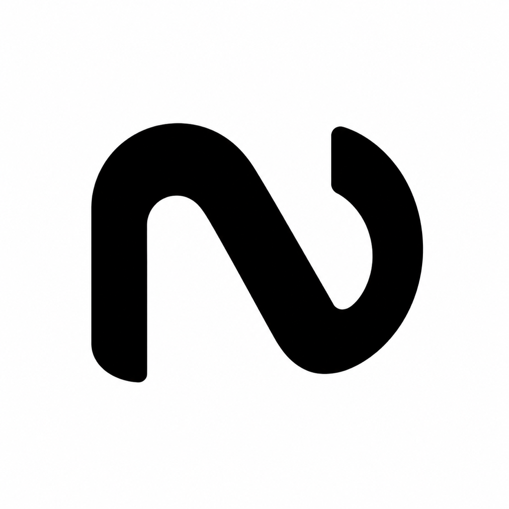

## 👋 I'm Shawn, a data engineer & full-stack software engineer

  &nbsp;
  &nbsp;
  &nbsp;
  &nbsp;
  

#### - Currently Senior Member of Technical Staff at  - PhD in Psychology from Stanford

<!-- Languages & tools -->
<h3></h3>

<!-- iOS apps -->
<h3></h3>

  &nbsp;&nbsp;&nbsp;
  &nbsp;&nbsp;&nbsp;
  

<!-- Mac apps -->
<h3></h3>

  &nbsp;&nbsp;&nbsp;
  &nbsp;&nbsp;&nbsp;
  

<!-- R packages -->
<h3></h3>

  &nbsp;&nbsp;
  &nbsp;&nbsp;
  

<!-- **App & web frameworks**

**Data & machine learning**

**Infrastructure & deployment**

-->
